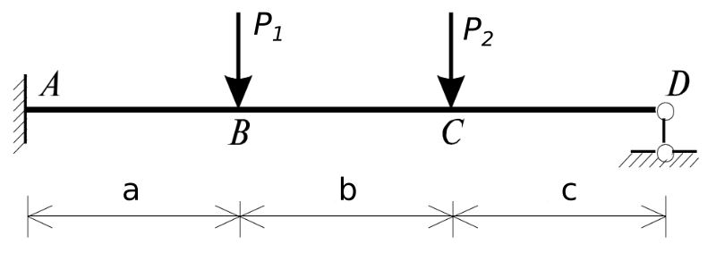

# октябрь 13. Линейное программирование
- Лекция: лекция пройдёт в discord в 10.15. ссылка будет в личном кабинете или у старосты. В discord нужно зарегистрироваться. 
- Материалы лекции:
  - https://github.com/VetrovSV/NLST/blob/master/examples/LinOpt.%20Simplex-method.ipynb
  - https://github.com/VetrovSV/NLST/blob/master/examples/SimplexMethod%20for%20beam.ipynb
- Темы:
  - Оптимизация. Линейное программирование
  - Применение линейного программирования для расчёта предельной нагрузки на балку.
- Для запска примеров и вычислений онлайн:
  - откройте google colab
       - меню File > Open Notebook > HitHub >
       - Вставьте ссылку https://github.com/VetrovSV/NLST/blob/master/examples/LinOpt.%20Simplex-method.ipynb
       - нажмите на поиск (лупу)
       - Откроется текст программы с вычислениями
       - Для запуска нужно войти в аккаунт Гугл
       - Запустите все вычисление: меню Runtime > Run All
       - Аналогично откройте файл https://github.com/VetrovSV/NLST/blob/master/examples/SimplexMethod%20for%20beam.ipynb
  - Другие способы открыть файл:
    - Способ 2: [Ссылка для запуска](https://mybinder.org/v2/gh/VetrovSV/NLST/master) Подготовка к запуску может занять несколько минут. После подготовки появится список файлов и папок.
   выберете examples > далее файл ```LinOpt. Simplex-method.ipynb``` Для запуска всех вычислений: меню Cells > Run All.
   Аналогично открывается файл ```SimplexMethod for beam.ipynb```
   - Способ 3:
        скачайте и установите [Anaconda](https://www.anaconda.com/products/individual). Запустите Jupyter Notebook. Скачайте файл с вычислениями. Откройте его в Jupyter Notebook
        Запустите все вычисления: меню Cells > Run All

# Задание
1. Закончите пункты 1-2 РГР. Сравните решения. Сделайте выводы.
2. Для схемы \
 \
с исходными данными:
  - варианты 1-4:  2a = b = c = 1м,
  - варианты 5-8:  a = 2b = c = 1м,
  - варианты 9-12: a = b = 2c = 1м,
  - P<sub>1</sub> = P, P<sub>2</sub> = 1.1 P.
  - n -- номер варианта
- запишите уравнения равновесия
- запишите уравнения моментов для *всех* точек, где может образоваться пластический шарнир
    - здесь не нужно рассматривать схемы образования пластических шарниров
    - не указывайте направление ментов на схеме, только точки в которых возможны пластические шарниры
    - в уравнениях используйте правило знаков: слева от сечения: ```+``` по ходу часовой стрелки; справа от сечения: ```+``` против хода часовой стрелки
- Запишете и пронумеруете все переменные задачи, включая моменты в опасных сечениях (см. второй пример из лекции): сначала реакции связей, затем внутренние моменты, затем искомая нагрузка.
  - Запишите уравнение целевой функции, которое требуется максимизировать -- уравнение нагрузки
  ```F -> max```
- Измените пример 2 https://github.com/VetrovSV/NLST/blob/master/examples/SimplexMethod%20for%20beam.ipynb под новую задачу
  1. запишите уравнения равновесия и уравнения для моментов в виде матрицы коэффициентов:
    ``` Например
    #               RA MB RC   MC MD RE    F
    #                1  2  3    4  5  6    7
    A = np.array( [ # уравнения равновесия. равенства
                  [1, 0, 1,   0, 0, 1,  -5],  # y
                  [0, 0, 2,   0, 0, 4,  -9],  # A
                  [-4, 0,-2,   0, 0, 0,  11],  # E
                # Уравнения для внутренних моментов. равенства
                  [-1, 1,0,   0, 0, 0,   0],  # B слева
                  [-2, 0,0,   1, 0, 0,   3],  # C слева
                  [ 0, 0,0,   0, 1,-1,   0]   # D справа
              ] )
    ```
  1. Запишите коэффициенты целевой функции  
   ``` Например
  # коэффициенты при неизвестных в целевой функции
  opt_fun = [0,0,0, 0,0,0, -1]  # -1, ибо функция -> max, а программа минимизирует функцию
  ```
  1. Задайте предельное значение для моментов
  ```Например
  # ограничение предельного момента
  absM = 300  # вычисляется Wпр = sigma_Т * W; (см. лекцию 1)
  ```
  1. Задайте предельное значение для нагрузки
  ``` Например
  # ограничение для сил
  absF = 10000  # задаётся заведомо недостижимое значение. если линейное программирование не срабатывает,
              # то значение нужно увеличить\уменьшить
  ```
  1. Запишите всё вместе: коэффициенты целевой функции, матрицу коэффициентов, ограничения для каждой переменной
  ``` Например
  linprog( opt_fun, A_eq = A,
           b_eq = [0]*6,  # правые части для равенств
        bounds=( (-absF, absF), (-absM, absM), (-absF, absF),
                 (-absM, absM), (-absM, absM), (-absF, absF),
                 (-absF, absF) ),
        method = 'interior-point' )
  ```
  1. Запустите вычисления
  1. Определите точки, где образовались пластические шарниры. Значения в этих точках может быть близким к предельному, но не равным в точности. Изобразите схемы образования пластических шарниров.
  1. Проверьте правильность определения предельной нагрузки решив задачу статическим или киниметическим способом.
  1. Оформите работу в pdf файле, включая расчёты в программе, аналитические расчёты и схему образования пластических шарниров.
