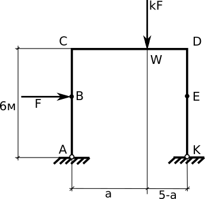

# РГР 2: Расчёт и оптимизация рамы по методу предельных состояний

1. Для заданной схемы определить реакции связей и предельное значение нагрузки
   - методом линейного программирования

   - Переменные задачи:
      - k = 1 + Nвар/10, Nвар -- номер варианта
      - a = (Nвар mod 10)/5, где mod 10 -- взятие остатка от деления
   - Приложенные силы
      - если вариант чётный, то у силы F поменяйте направление и приложите справа.
      - в вариантах 1-6, сила F приложена к т. B или E
      - в вариантах 7-12, сила F приложена к т. C или D
1. Указать механизм разрушения рамы
1. Проверить решение статическим способом
1. Проверить решение кинематическим способом
1. Провести оптимизацию рамы при сохранении текущих реакций связей; провести оптимизацию с возможным изменением реакций связей и схемы деформирования
1. Оформить работу в pdf. Рукописные записи можно сканировать и добавить в документ как изображение. Отправить файл на проверку.
