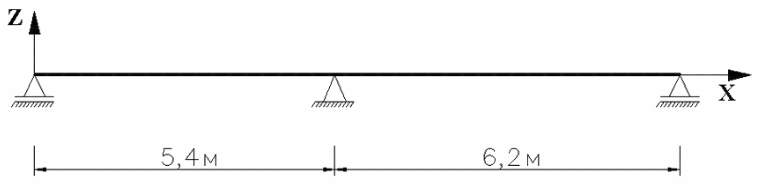
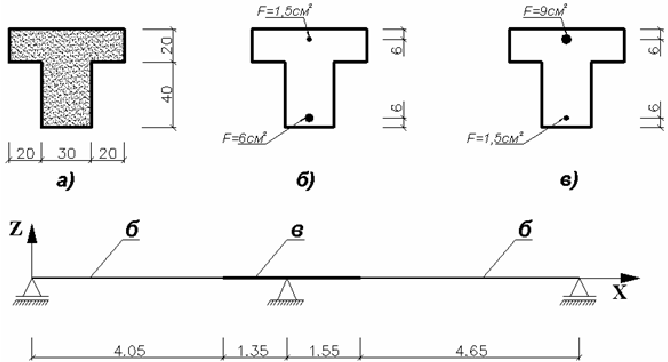

# Учёт физической нелинейности в ЛИРА САПР. 
1. Изучите схему задачи

3. Создайте расчётную схему в ЛИРА-САПР: 
   - http://www.liraland.ru/public_private/lira/2015/example/Example7.pdf
   - рассчитайте балку
5. В отчёт сохраните:
   - задание,
   - эпюры моментов, 
   - вид деформированной балки, 4 или больше этапов деформирования
   - таблицу со значениями перемещений

# Вопросы
1.	Какая модель деформирования использовалась для бетона и армирования?
2.	Что такое ползучесть материала? Каким законом она описывалась?
3.	Что такое метод последовательных нагружений?
4.	Какие варианты нагрузок рассматривались?
